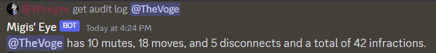
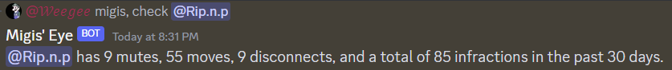

# Discord Audit Eye

- Given a user, tracks the amount of mutes, moves, and disconnects that a user has done to another user.
- Accomplishes this by parsing the Discord Audit Log, searching for specific action commands

- Allows custom text to be set to allow the user to set any trigger message for the bot to search a user.

Example of the bot being used with the trigger message of "get audit log"

Example of the bot being used with the trigger message of "migis, check"

# How to use

- Download files
- Add your Discord Bots ID to the .env file and rename it to `.env`
- type `npm install` inside the terminal
- type `node index.js` to run the bot

To change the access command, go inside `index.js` and change the `access_command` variable to be any string you want. The bot will look for the username in the format of `<access_command> <@user>`
